# Awesome Mamba Papers on Medical Domain 

This repository includes all the referenced papers, along with the sections covered in the survey titled **A Comprehensive Survey of Mamba Architectures for Medical Image Analysis: Classification, Segmentation, Restoration, and Beyond.** If you encounter any issues with the links or notice any errors, please feel free to reach out via email at 21204028@rmd.ac.in

While some papers may be repeated, our objective is to highlight the papers available in each specific sections. For the best experience, we recommend keeping this repository open alongside the topics you are currently reading. If you wish to explore further, this resource can serve as a useful tool.

## News
Version 1 of the paper is out on arxiv (4/10/2024) - [Paper](https://arxiv.org/abs/2410.02362)

## Table of Contents
<details>
<summary><b>(click to expand)</b></summary>

1. [Prequisites](#prerequisites) 
2. [Medical Image Analysis using Mamba](#types-of-mamba-architectures)
    1. [Mamba Architectures](#types-of-mamba-architectures)
        1. [Pure Mamba](#pure-mamba---just-comprises-of-mamba-block)
        1. [Variants of U-Net](#variants-of-unet)
        1. [Hybrid architectures](#hybrid-architectures)
    2. [Scanning](#scanning)
    3. [Mamba Optimizations](#mamba-optimizations)
    4. [Techniques and Adaptations](#techniques-and-adaptations)

    5. [Applications in Various Medical Domains](#applications)
        1. [Medical Image Segmentation](#medical-image-segmentation)
        1. [Medical Image Classification](#medical-image-classification)
        1. [Medical Image Restoration/Reconstruction](#medical-image-restoration-reconstruction)
        1. [Medical Image Registration](#medical-image-registration)

3. [Datasets](#datasets)


4. [Other Papers beyond this paper](#other-papers-beyond-this-paper)
    1. [Mamba v2](#mamba-v2)
    1. [xLSTM](#xlstm)
5. [Citation](#cite-the-paper)
</details>


## Prerequisites

<p align="center" width="100%">
  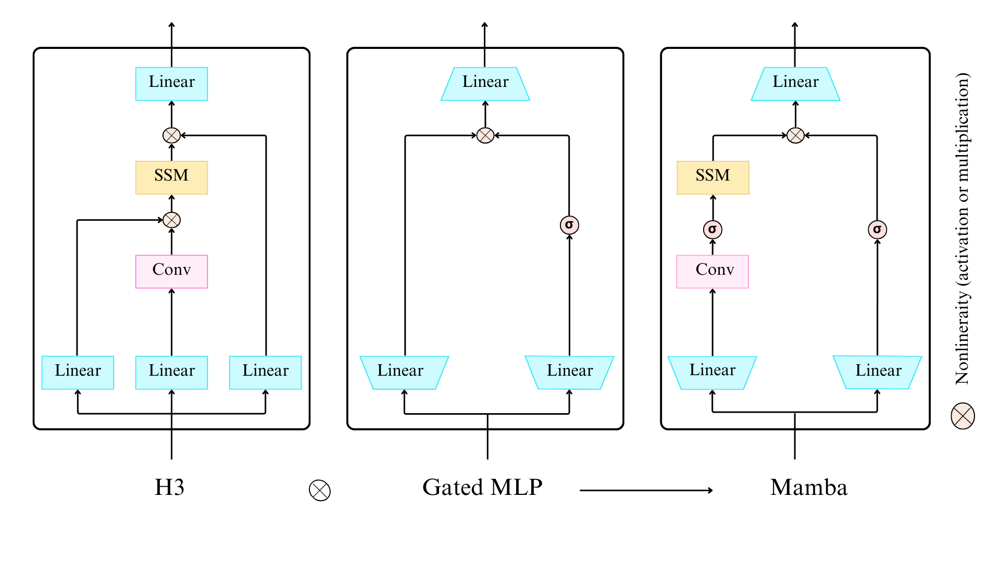
  <p align="center"> Figure 1 - General Illustration of <a href="https://arxiv.org/pdf/2312.00752">Mamba models</a> </p>
</p>


Recurrent Networks such as LSTM,RNN GRU 

(NIPS-17) Attention is all you need - [[Paper]](https://arxiv.org/abs/1706.03762) [[Code]](https://github.com/tensorflow/tensor2tensor) 

(arXiv:2111.00396) Efficiently Modeling Long Sequences with Structured State Spaces (S4)- [[Paper]](https://arxiv.org/abs/2111.00396) [[Code]](https://github.com/state-spaces/s4) 

(arXiv:2208.04933) Simplified State Space Layers for Sequence Modeling (S5) - [[Paper]](https://arxiv.org/abs/2208.04933) [[Code]](https://github.com/lindermanlab/S5) 


(arXiv:2008.07669) HiPPO: Recurrent Memory with Optimal Polynomial Projections - [[Paper]](https://arxiv.org/abs/2008.07669) [[Code]](https://github.com/HazyResearch/hippo-code) 

(arXiv:2212.14052) Hungry Hungry Hippos: Towards Language Modeling with State Space Models - [[Paper]](https://arxiv.org/abs/2212.14052) [[Code]](https://github.com/HazyResearch/H3) 


(arXiv:2312.00752) Mamba: Linear-Time Sequence Modeling with Selective State Spaces - [[Paper]](https://arxiv.org/abs/2312.00752) [[Code]](https://github.com/state-spaces/mamba) 

(arXiv:2302.10866) Hyena Hierarchy: Towards Larger Convolutional Language Models - [[Paper]](https://arxiv.org/abs/2302.10866)

## Types of Mamba architectures on Medical Image Analysis
In this section, the papers are cited according to the survey. The survey provides an overview of these models, beginning with their core architectures. The models are classified into three categories:  [Pure Mamba](#pure-mamba) which consists solely of Mamba blocks; [Variants of Unet](#) which includes models that adapt a U-Net-based architecture; [Hybrid architectures](#) which incorporate Mamba blocks with attention mechanisms, convolution, or RNNs.

## Pure Mamba

<p align="center" width="100%">
  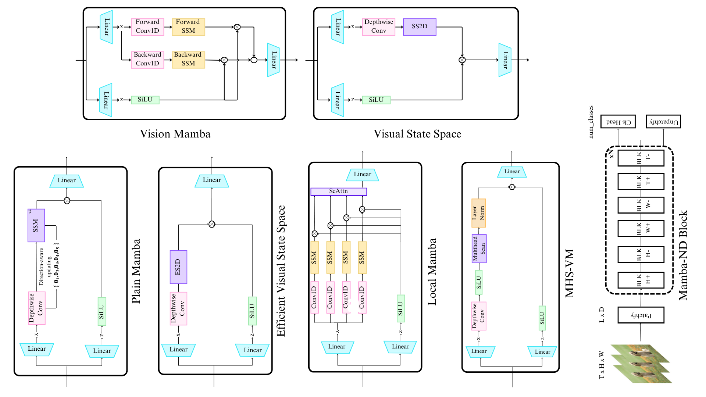
  <p align="center">Figure 2- Illustration of different Mamba architectures such as <a href="https://arxiv.org/abs/2401.09417">ViM</a>, <a href="https://arxiv.org/abs/2401.10166">VMamba</a>, <a href="https://arxiv.org/abs/2403.17695">PlainMamba</a>, <a href="https://arxiv.org/abs/2403.09977">EfficientVMamba</a>, <a href="https://arxiv.org/abs/2402.05892">Mamba-ND</a>, <a href="https://arxiv.org/abs/2406.05992">MHS-VM</a>
  </p>
</p>


(arXiv:2401.09417) Vision Mamba: Efficient Visual Representation Learning with Bidirectional State Space Model (ViM) - [[Paper]](https://arxiv.org/abs/2401.09417)  [[Code]](https://github.com/hustvl/Vim) 

(arXiv:2401.10166) VMamba: Visual State Space Model (VSS) - [[Paper]](https://arxiv.org/abs/2401.10166)  [[Code]](https://github.com/MzeroMiko/VMamba) 

(arXiv:2403.17695) PlainMamba: Improving Non-Hierarchical Mamba in Visual Recognition - [[Paper]](https://arxiv.org/abs/2403.17695)  [[Code]](https://github.com/ChenhongyiYang/PlainMamba) 

(arXiv:2403.09977) EfficientVMamba: Atrous Selective Scan for Light Weight Visual Mamba (EVSS) - [[Paper]](https://arxiv.org/abs/2403.09977)  [[Code]](https://github.com/TerryPei/EfficientVMamba) 

(arXiv:2402.05892) Mamba-ND: Selective State Space Modeling for Multi-Dimensional Data - [[Paper]](https://arxiv.org/abs/2402.05892)  [[Code]](https://github.com/jacklishufan/Mamba-ND) 

(arXiv:2406.05992) MHS-VM: Multi-Head Scanning in Parallel Subspaces for Vision Mamba - [[Paper]](https://arxiv.org/abs/2406.05992)  [[Code]](https://github.com/PixDeep/MHS-VM) 


## Variants of Unet

<p align="center" width="100%">
  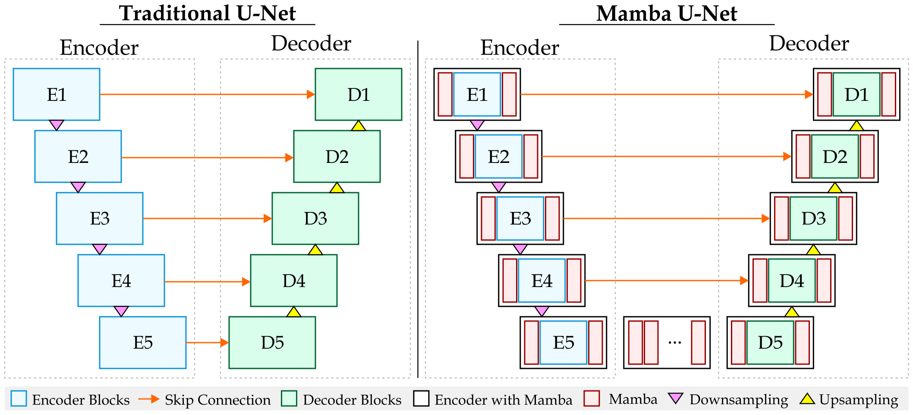
  <p align="center">Figure 3 - Traditional UNet vs <a href="https://arxiv.org/abs/2402.05079">Mamba U Net</a></p>
</p>

(arXiv:2402.05079) Mamba-UNet: UNet-Like Pure Visual Mamba for Medical Image Segmentation -[[Paper]](https://arxiv.org/abs/2402.05079) [[Code]]( https://github.com/ziyangwang007/Mamba-UNet) 

(arXiv:2404.07705) ViM-UNet: Vision Mamba for Biomedical Segmentation - [[Paper]](https://arxiv.org/abs/2404.07705)  [[Code]](https://github.com/constantinpape/torch-em) 


<p align="center" width="100%">
  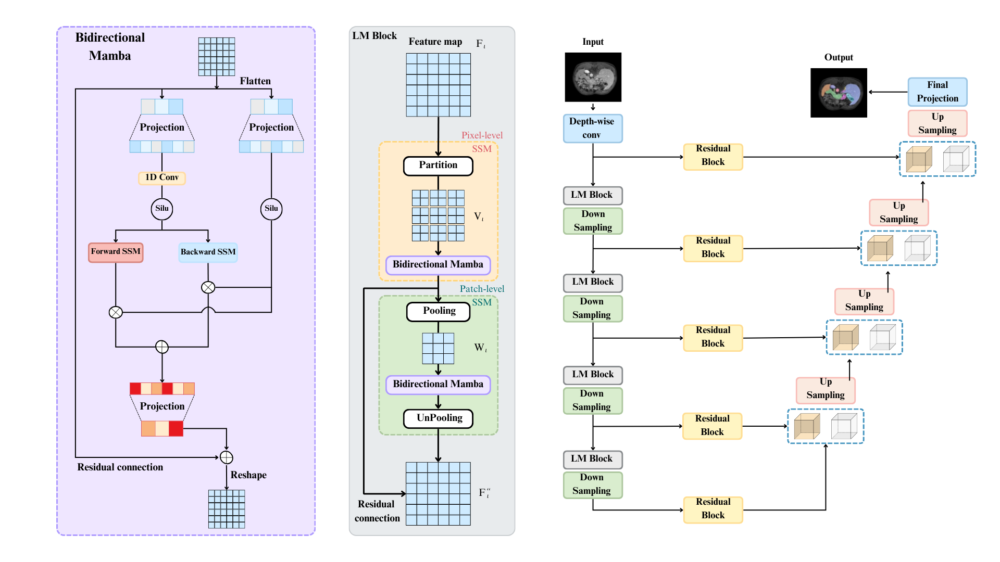
  <p align="center">Figure 4 - Architecture diagram of <a href="https://arxiv.org/abs/2403.07332">LKM-UNet</a></p>
</p>

(arXiv:2403.07332) LKM-UNet: Large Kernel Vision Mamba UNet for Medical Image Segmentation - [[Paper]](https://arxiv.org/abs/2403.07332)  [[Code]](https://github.com/wjh892521292/LKM-UNet) 

<p align="center" width="100%">
  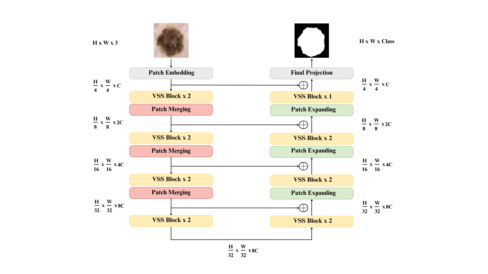
  <p align="center">Figure 5 - Architecture diagram of <a href="https://arxiv.org/abs/2402.02491">VM-UNET</a></p>
</p>

(arXiv:2402.02491) VM-UNet: Vision Mamba UNet for Medical Image Segmentation - [[Paper]](https://arxiv.org/abs/2402.02491) [[Code]](https://github.com/JCruan519/VM-UNet) 

<p align="center" width="100%">
  
  <p align="center">Figure 6 - Architecture diagram of <a href="https://arxiv.org/abs/2403.09157">VM-UNET-V2</a></p>
</p>

(arXiv:2403.09157) VM-UNET-V2 Rethinking Vision Mamba UNet for Medical Image Segmentation - [[Paper]](https://arxiv.org/abs/2403.09157) [[Code]](https://github.com/nobodyplayer1/VM-UNetV2) 

<p align="center" width="100%">
  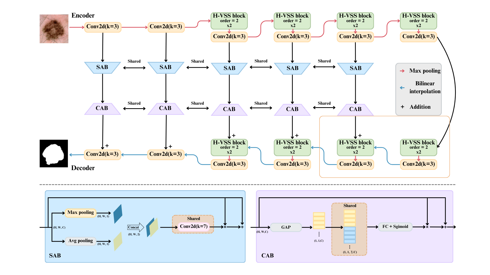
  <p align="center">Figure 7 - Architecture diagram of <a href="https://arxiv.org/abs/2403.13642">H-vmunet</a></p>
</p>

(arXiv:2403.13642) H-vmunet: High-order Vision Mamba UNet for Medical Image Segmentation - [[Paper]](https://arxiv.org/abs/2403.13642)  [[Code]](https://github.com/wurenkai/H-vmunet) 

## Scanning

<p align="center" width="100%">
  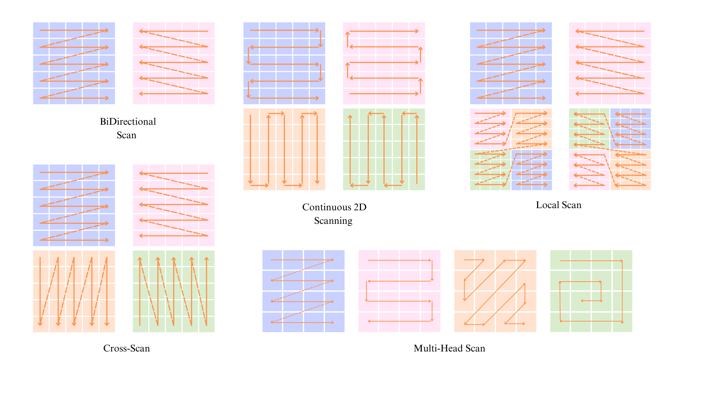
  <p align="center">Figure 8 - Illustration of <a href="https://arxiv.org/abs/2401.09417">Bidirectional Scan</a>,<a href="https://arxiv.org/abs/2403.17695">Continous 2D Scanning</a>,<a href="https://arxiv.org/abs/2403.09338">Local Scan</a>, <a href="https://arxiv.org/abs/2403.17695">Cross Scan</a>,<a href="https://arxiv.org/abs/2406.05992">Multi head Scan</a></p>
</p>
<p align="center" width="100%">
  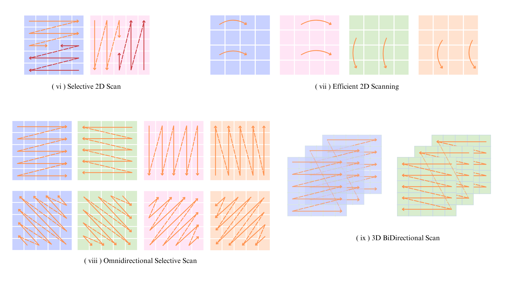
  <p align="center">Figure 9 - Illustration of <a href="https://arxiv.org/abs/2401.10166">Selective 2D Scan</a>, <a href="https://arxiv.org/abs/2403.09977">Efficient 2D Scan</a>, <a href="https://arxiv.org/abs/2403.11423">Omnidirection Selective Scan</a>, <a href="https://arxiv.org/abs/2403.17695">3D Bidirectional Scan</a></p>
</p>
<p align="center" width="100%">
  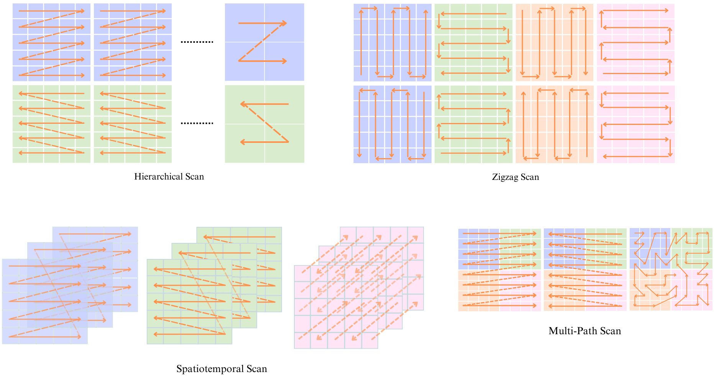
  <p align="center">Figure 10 - Illustration of <a href="https://arxiv.org/abs/2403.07487">Hierarchical Scan</a>, <a href="https://arxiv.org/abs/2403.13802">Zigzag Scan</a>, <a href="https://arxiv.org/abs/2401.14168">Spatiotemporal Scan</a>,<a href="https://arxiv.org/abs/2403.19654">Multi-Path Scan</a>

</p>
<p align="center" width="100%">
  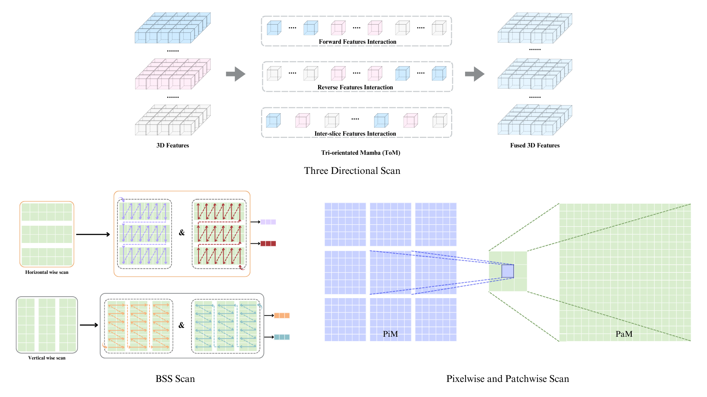
  <p align="center">Figure 11 - Illustration of <a href="">Three Directional Scan</a>, <a href="https://arxiv.org/abs/2407.08481">BSS Scan</a>, <a href="https://arxiv.org/abs/2403.07332">Pixelwise and Patchwise Scan</a>
</p>

  1. Bidirectional Scan (Forward and backward Scan)

     **Initally proposed by:**
    
     (arXiv:2401.09417) Vision Mamba: Efficient Visual Representation Learning with Bidirectional State Space Model (ViM) - [[Paper]](https://arxiv.org/abs/2401.09417)  [[Code]](https://github.com/hustvl/Vim) 

     **Other paper which incorporates it:**

     (arXiv:2403.05146)Motion-Guided Dual-Camera Tracker for Endoscope Tracking and Motion Analysis in a Mechanical Gastric Simulator[[Paper]](https://arxiv.org/abs/2403.05146)

     (arXiv:2406.05786) CAMS: Convolution and Attention-Free Mamba-based Cardiac Image Segmentation - [[Paper]](https://arxiv.org/abs/2406.05786) 

     (arXiv:2403.05160) MamMIL: Multiple Instance Learning for Whole Slide Images with State Space Models - [[Paper]](https://arxiv.org/abs/2403.05160) 

    

  2. Selective Scan 2D
  
     **Initally proposed by:**

     (arXiv:2401.10166) VMamba: Visual State Space Model (VSS) - [[Paper]](https://arxiv.org/abs/2401.10166)  [[Code]](https://github.com/MzeroMiko/VMamba) 

     **Other paper which incorporates it:**

     (arXiv:2403.03849) MedMamba: Vision Mamba for Medical Image Classification - [[Paper]](https://arxiv.org/abs/2403.03849) [[Code]](https://github.com/YubiaoYue/MedMamba) 

     (arXiv:2402.10887) Weak-Mamba-UNet: Visual Mamba Makes CNN and ViT Work Better for Scribble-based Medical Image Segmentation - [[Paper]](https://arxiv.org/abs/2402.10887) [[Code]](https://github.com/ziyangwang007/Mamba-UNet) 

     (arXiv:2402.08506v2) P-Mamba: Marrying Perona Malik Diffusion with Mamba for Efficient Pediatric Echocardiographic Left Ventricular Segmentation - [[Paper]](https://arxiv.org/abs/2402.08506v2)


     (arXiv:2403.05246) LightM-UNet: Mamba Assists in Lightweight UNet for Medical Image Segmentation - [[Paper]](https://arxiv.org/abs/2403.05246) [[Code]](https://github.com/MrBlankness/LightM-UNet) 
    
     (arXiv:2405.05007) HC-Mamba: Vision MAMBA with Hybrid Convolutional Techniques for Medical Image Segmentation - [[Paper]](https://arxiv.org/abs/2405.05007)
    
     (arXiv:2403.17432)Integrating Mamba Sequence Model and Hierarchical Upsampling Network for Accurate Semantic Segmentation of Multiple Sclerosis Legion - [[Paper]](https://arxiv.org/abs/2403.17432)

     (arXiv:2403.20035) UltraLight VM-UNet: Parallel Vision Mamba Significantly Reduces Parameters for Skin Lesion Segmentation - [[Paper]](https://arxiv.org/abs/2403.20035) [[Code]](https://github.com/wurenkai/UltraLight-VM-UNet) 

     (arXiv:2402.02491) VM-UNet: Vision Mamba UNet for Medical Image Segmentation - [[Paper]](https://arxiv.org/abs/2402.02491) [[Code]](https://github.com/JCruan519/VM-UNet) 

     (arXiv:2403.09157) VM-UNET-V2 Rethinking Vision Mamba UNet for Medical Image Segmentation - [[Paper]](https://arxiv.org/abs/2403.09157) [[Code]](https://github.com/nobodyplayer1/VM-UNetV2) 
    
     (arXiv:2404.05105) VMambaMorph: a Multi-Modality Deformable Image Registration Framework based on Visual State Space Model with Cross-Scan Module [[Paper]](https://arxiv.org/abs/2404.05105) [[Code]](https://github.com/ziyangwang007/VMambaMorph) 

     (arXiv:2402.18451) MambaMIR: An Arbitrary-Masked Mamba for Joint Medical Image Reconstruction and Uncertainty Estimation [[Paper]](https://arxiv.org/abs/2402.18451) [[Code]](https://github.com/ayanglab/MambaMIR)

     (arXiv:2402.07245) Semi-Mamba-UNet: Pixel-Level Contrastive and Pixel-Level Cross-Supervised Visual Mamba-based UNet for Semi-Supervised Medical Image Segmentation - [[Paper]](https://arxiv.org/abs/2402.07245) [[Code]](https://github.com/ziyangwang007/Mamba-UNet) 

     (arXiv:2402.03302) Swin-UMamba: Mamba-based UNet with ImageNet-based pretraining - [[Paper]](https://arxiv.org/abs/2402.03302) [[Code]](https://github.com/JiarunLiu/Swin-UMamba) 

     (arXiv:2402.05079) Mamba-UNet: UNet-Like Pure Visual Mamba for Medical Image Segmentation - [[Paper]](https://arxiv.org/abs/2402.05079) [[Code]](https://github.com/ziyangwang007/Mamba-UNet) 

     (arXiv:2403.13642) H-vmunet: High-order Vision Mamba UNet for Medical Image Segmentation - [[Paper]](https://arxiv.org/abs/2403.13642)  [[Code]](https://github.com/wurenkai/H-vmunet) 

     (arXiv:2405.05667) VM-DDPM: Vision Mamba Diffusion for Medical Image Synthesis [[Paper]](https://arxiv.org/abs/2405.05667)

3. Continous 2D Scanning
  
   **Initally proposed by:**
    

     (arXiv:2403.17695) PlainMamba: Improving Non-Hierarchical Mamba in Visual Recognition - [[Paper]](https://arxiv.org/abs/2403.17695)  [[Code]](https://github.com/ChenhongyiYang/PlainMamba) 
     

4. Spatiotemporal Selective Scan

     (arXiv:2401.14168) Vivim: a Video Vision Mamba for Medical Video Segmentation - [[Paper]](https://arxiv.org/abs/2401.14168) [[Code]](https://github.com/scott-yjyang/Vivim) 

5. Local Scanning
  **Initally proposed by:**

   (arXiv:2403.09338) LocalMamba: Visual State Space Model with Windowed Selective Scan - [[Paper]](https://arxiv.org/abs/2403.09338) [[Code]](https://github.com/hunto/LocalMamba) 

   **Other paper which incorporates it:**
   (arXiv:2404.09476) FreqMamba: Viewing Mamba from a Frequency Perspective for Image Deraining - [[Paper]](https://arxiv.org/abs/2404.09476) [[Code]](https://github.com/aSleepyTree/FreqMamba) 

6. Efficient 2D Scan

   EfficientVMamba: Atrous Selective Scan for Light Weight Visual Mamba - [[Paper]](https://arxiv.org/abs/2403.09977) [[Code]](https://github.com/TerryPei/EfficientVMamba) 

   (arXiv:2404.09498) FusionMamba: Dynamic Feature Enhancement for Multimodal Image Fusion with Mamba - [[Paper]](https://arxiv.org/abs/2404.09498) [[Code]](https://github.com/millieXie/FusionMamba) 

7. Multi-Path Scan
  
   (arXiv:2403.19654) RSMamba: Remote Sensing Image Classification with State Space Model - [[Paper]](https://arxiv.org/abs/2403.19654)

8. Omnidirectional Selective Scan

   (arXiv:2403.11423)VmambaIR: Visual State Space Model for Image Restoration -  [[Paper]](https://arxiv.org/abs/2403.11423) [[Code]](https://github.com/AlphacatPlus/VmambaIR) 

9. Hierarchical Scan

   (ECCV 24) Motion Mamba: Efficient and Long Sequence Motion Generation[[Paper]](https://arxiv.org/abs/2403.07487) [[Code]](https://github.com/steve-zeyu-zhang/MotionMamba) 

10. Multi-Head Scan

    (arXiv:2406.05992) MHS-VM: Multi-Head Scanning in Parallel Subspaces for Vision Mamba - [[Paper]](https://arxiv.org/abs/2406.05992)  [[Code]](https://github.com/PixDeep/MHS-VM) 

11. Zigzag Scan
    (ECCV 2024) ZigMa: A DiT-style Zigzag Mamba Diffusion Model - [[Paper]](https://arxiv.org/abs/2403.13802) [[Code]](https://github.com/CompVis/zigma) 

12. Other Scanning Mechanisms

     **TOM(Tri-orientated Spatial Mamba) - Three directional scanning** - (arXiv:2401.13560) SegMamba: Long-range Sequential Modeling Mamba For 3D Medical Image Segmentation - [[Paper]](https://arxiv.org/abs/2401.13560) [[Code]](https://github.com/ge-xing/SegMamba) 

     **Pixelwise and patchwise Scan** - (arXiv:2403.07332) LKM-UNet: Large Kernel Vision Mamba UNet for Medical Image Segmentation - [[Paper]](https://arxiv.org/abs/2403.07332) [[Code]](https://github.com/wjh892521292/LKM-UNet) 

     **Slice Scan** - (arXiv:2407.08481) SliceMamba with Neural Architecture Search for Medical Image Segmentation [[Paper]](https://arxiv.org/abs/2407.08481)


## Hybrid Architectures
### Mamba with Convolution

<p align="center" width="100%">
  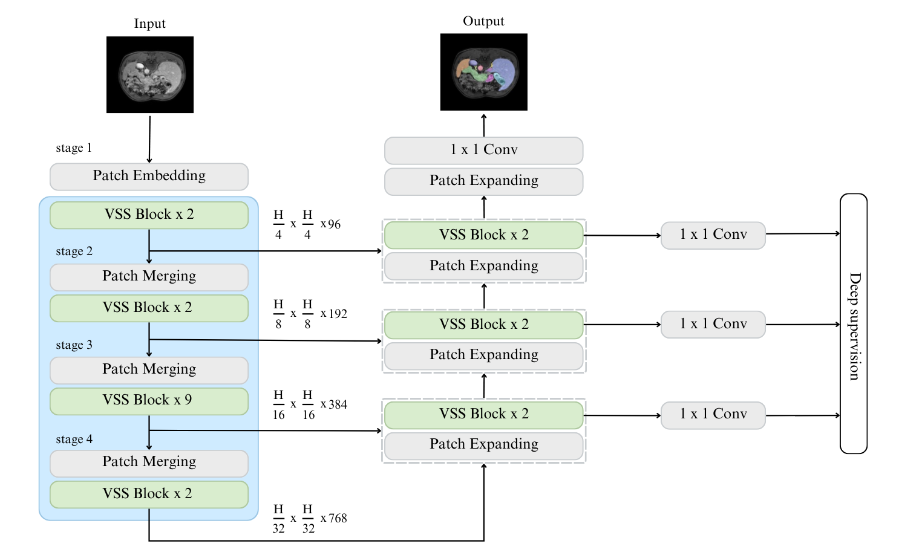
  <p align="center">Figure 12 - Architecture Diagram of <a href="https://arxiv.org/abs/2402.03302">Swin-UMamba</a></p>
</p>

(arXiv:2402.03302) Swin-UMamba: Mamba-based UNet with ImageNet-based pretraining - [[Paper]](https://arxiv.org/abs/2402.03302) [[Code]](https://github.com/JiarunLiu/Swin-UMamba) 

(arXiv:2402.03526) nnMamba: 3D Biomedical Image Segmentation, Classification and Landmark Detection with State Space Model - [[Paper]](https://arxiv.org/abs/2402.03526) [[Code]](https://github.com/lhaof/nnMamba) 


(DOI:10.48550/arXiv.2401.04722) U-Mamba: Enhancing Long-range Dependency for Biomedical Image Segmentation - [[Paper]](https://api.semanticscholar.org/CorpusID:266899624) [[Code]](https://github.com/bowang-lab/U-Mamba) 


(arXiv:2402.05079) Mamba-UNet: UNet-Like Pure Visual Mamba for Medical Image Segmentation - [[Paper]](https://arxiv.org/abs/2402.05079) [[Code]](https://github.com/ziyangwang007/Mamba-UNet) 

(arXiv:2405.05007) HC-Mamba: Vision MAMBA with Hybrid Convolutional Techniques for Medical Image Segmentation - [[Paper]](https://arxiv.org/abs/2405.05007)

(arXiv:2401.13560) SegMamba: Long-range Sequential Modeling Mamba For 3D Medical Image Segmentation - [[Paper]](https://arxiv.org/abs/2401.13560) [[Code]](https://github.com/ge-xing/SegMamba) 

### Mamba with Attention and Transformers

Tri-Plane Mamba: Efficiently Adapting Segment Anything Model for 3D Medical Images -[[Paper]](https://arxiv.org/abs/2409.08492) [[Code]](https://github.com/xmed-lab/TP-Mamba) 

(arXiv:2402.10887) Weak-Mamba-UNet: Visual Mamba Makes CNN and ViT Work Better for Scribble-based Medical Image Segmentation - [[Paper]](https://arxiv.org/abs/2402.10887) [[Code]](https://github.com/ziyangwang007/Mamba-UNet) 

(arXiv:2408.11289) HMT-UNet: A hybird Mamba-Transformer Vision UNet for Medical Image Segmentation - [[Paper]](https://arxiv.org/abs/2408.11289) [[Code]](https://github.com/simzhangbest/HMT-Unet) 

### Mamba with Recurrance
(arXiv:2403.16536) VMRNN: Integrating Vision Mamba and LSTM for Efficient and Accurate Spatiotemporal Forecasting - [[Paper]](https://arxiv.org/abs/2403.16536) [[Code]](https://github.com/yyyujintang/VMRNN-PyTorch) 

### Mamba with GNN
(arXiv:2406.04377) Combining Graph Neural Network and Mamba to Capture Local and Global Tissue Spatial Relationships in Whole Slide Images - [[Paper]](https://api.semanticscholar.org/CorpusID:270357797) [[Code]](https://github.com/rina-ding/gat-mamba) 


### Miscellaneous
(arXiv:2404.13222) Vim4Path: Self-Supervised Vision Mamba for Histopathology Images - [[Paper]](https://arxiv.org/abs/2404.13222) [[Code]](https://github.com/AtlasAnalyticsLab/Vim4Path)


(arXiv:2403.06800) MambaMIL: Enhancing Long Sequence Modeling with Sequence Reordering in Computational Pathology - [[Paper]](https://arxiv.org/abs/2403.06800)[[Code]](https://github.com/isyangshu/MambaMIL) 

## Mamba Optimizations
### Lightweight and Efficient

(arXiv:2403.05246) LightM-UNet: Mamba Assists in Lightweight UNet for Medical Image Segmentation - [[Paper]](https://arxiv.org/abs/2403.05246) [[Code]](https://github.com/MrBlankness/LightM-UNet) 

(arXiv:2403.20035) UltraLight VM-UNet: Parallel Vision Mamba Significantly Reduces Parameters for Skin Lesion Segmentation - [[Paper]](https://arxiv.org/abs/2403.20035) [[Code]](https://github.com/wurenkai/UltraLight-VM-UNet) 

(arXiv:2405.15925) MUCM-Net: A Mamba Powered UCM-Net for Skin Lesion Segmentation - [[Paper]](https://arxiv.org/abs/2405.15925) [[Code]](https://github.com/chunyuyuan/MUCM-Net) 

LightCF-Net: A Lightweight Long-Range Context Fusion Network for Real-Time Polyp Segmentation  - [[Paper]](https://doi.org/10.3390/bioengineering11060545) 

Balancing High-performance and Lightweight: HL-UNet for 3D Cardiac Medical Image Segmentation - [[Paper]](https://doi.org/10.1016/j.acra.2024.06.008) 

(arXiv:2403.02148) MiM-ISTD: Mamba-in-Mamba for Efficient Infrared Small Target Detection - [[Paper]](https://arxiv.org/abs/2403.02148) [[Code]](https://github.com/txchen-USTC/MiM-ISTD) 

## Techniques and Adaptations
### Weakly Supervised Learning
(arXiv:2402.10887) Weak-Mamba-UNet: Visual Mamba Makes CNN and ViT Work Better for Scribble-based Medical Image Segmentation - [[Paper]](https://arxiv.org/abs/2402.10887) [[Code]](https://github.com/ziyangwang007/Mamba-UNet) 

### Semi Supervised Learning
(arXiv:2402.07245) Semi-Mamba-UNet: Pixel-Level Contrastive and Pixel-Level Cross-Supervised Visual Mamba-based UNet for Semi-Supervised Medical Image Segmentation - [[Paper]](https://arxiv.org/abs/2402.07245) [[Code]](https://github.com/ziyangwang007/Mamba-UNet) 

### Self Supervised Learning
(arXiv:2404.13222) Vim4Path: Self-Supervised Vision Mamba for Histopathology Images - [[Paper]](https://arxiv.org/abs/2404.13222) [[Code]](https://github.com/AtlasAnalyticsLab/Vim4Path) 

(arXiv:2408.08070) MambaMIM: Pre-training Mamba with State Space Token-interpolation - [[Paper]](https://arxiv.org/abs/2408.08070) [[Code]](https://github.com/FengheTan9/MambaMIM) 


(arXiv:2403.16520) CMViM: Contrastive Masked Vim Autoencoder for 3D Multi-modal Representation Learning for AD classification - [[Paper]](https://arxiv.org/abs/2403.16520)


### Multimodal Learning

<p align="center" width="100%">
  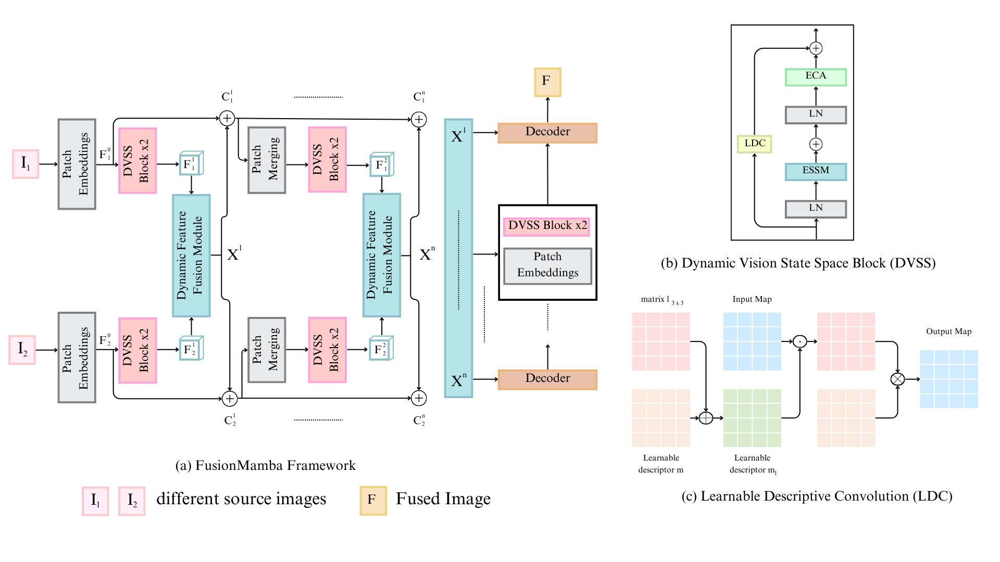
  <p align="center">Figure 13 - Architecture Diagram of <a href="https://arxiv.org/abs/2404.09498">Fusion Mamba</a></p>
</p>

(arXiv:2404.09498) FusionMamba: Dynamic Feature Enhancement for Multimodal Image Fusion with Mamba - [[Paper]](https://arxiv.org/abs/2404.09498) [[Code]](https://github.com/millieXie/FusionMamba) 


(arXiv:2406.00631) MGI: Multimodal Contrastive pre-training of Genomic and Medical Imaging - [[Paper]](https://arxiv.org/abs/2406.00631)


(arXiv:2407.15719) GFE-Mamba: Mamba-based AD Multi-modal Progression Assessment via Generative Feature Extraction from MCI - [[Paper]](https://arxiv.org/abs/2407.15719) [[Code]](https://github.com/Tinysqua/GFE-Mamba) 

## Applications
### Medical Image Segmentation

<p align="center" width="100%">
  
  <p align="center">Figure 14 - General Flow of Segmentation</p>
</p>

(arXiv:2401.13560) SegMamba: Long-range Sequential Modeling Mamba For 3D Medical Image Segmentation - [[Paper]](https://arxiv.org/abs/2401.13560) [[Code]](https://github.com/ge-xing/SegMamba) 

(arXiv:2403.13642) H-vmunet: High-order Vision Mamba UNet for Medical Image Segmentation - [[Paper]](https://arxiv.org/abs/2403.13642) [[Code]](https://github.com/wurenkai/H-vmunet) 

(arXiv:2403.07332) LKM-UNet: Large Kernel Vision Mamba UNet for Medical Image Segmentation - [[Paper]](https://arxiv.org/abs/2403.07332) [[Code]](https://github.com/wjh892521292/LKM-UNet) 

(arXiv:2402.05079) Mamba-UNet: UNet-Like Pure Visual Mamba for Medical Image Segmentation - [[Paper]](https://arxiv.org/abs/2402.05079) [[Code]](https://github.com/ziyangwang007/Mamba-UNet) 

(arXiv:2402.10887) Weak-Mamba-UNet: Visual Mamba Makes CNN and ViT Work Better for Scribble-based Medical Image Segmentation - [[Paper]](https://arxiv.org/abs/2402.10887) [[Code]](https://github.com/ziyangwang007/Mamba-UNet) 

(arXiv:2403.05246) LightM-UNet: Mamba Assists in Lightweight UNet for Medical Image Segmentation - [[Paper]](https://arxiv.org/abs/2403.05246) [[Code]](https://github.com/MrBlankness/LightM-UNet) 

(arXiv:2403.20035) UltraLight VM-UNet: Parallel Vision Mamba Significantly Reduces Parameters for Skin Lesion Segmentation - [[Paper]](https://arxiv.org/abs/2403.20035) [[Code]](https://github.com/wurenkai/UltraLight-VM-UNet) 

(arXiv:2404.01065) T-Mamba: A unified framework with Long-Range Dependency in dual-domain for 2D & 3D Tooth Segmentation - [[Paper]](https://arxiv.org/abs/2404.01065) [[Code]](https://github.com/isbrycee/T-Mamba) 

(arXiv:2405.05007) HC-Mamba: Vision MAMBA with Hybrid Convolutional Techniques for Medical Image Segmentation - [[Paper]](https://arxiv.org/abs/2405.05007) 

(arXiv:2402.07245) Semi-Mamba-UNet: Pixel-Level Contrastive and Pixel-Level Cross-Supervised Visual Mamba-based UNet for Semi-Supervised Medical Image Segmentation - [[Paper]](https://arxiv.org/abs/2402.07245) [[Code]](https://github.com/ziyangwang007/Mamba-UNet) 

(arXiv:2404.07705) ViM-UNet: Vision Mamba for Biomedical Segmentation - [[Paper]](https://arxiv.org/abs/2404.07705) [[Code]](https://github.com/constantinpape/torch-em) 

(arXiv:2401.04722) U-Mamba: Enhancing Long-range Dependency for Biomedical Image Segmentation - [[Paper]](https://api.semanticscholar.org/CorpusID:266899624) [[Code]](https://github.com/bowang-lab/U-Mamba) 

(arXiv:2403.17432) Integrating Mamba Sequence Model and Hierarchical Upsampling Network for Accurate Semantic Segmentation of Multiple Sclerosis Legion - [[Paper]](https://arxiv.org/abs/2403.17432) 

(arXiv:2405.17496) UU-Mamba: Uncertainty-aware U-Mamba for Cardiac Image Segmentation - [[Paper]](https://arxiv.org/abs/2405.17496) [[Code]](https://github.com/tiffany9056/UU-Mamba) 

(arXiv:2406.05786) CAMS: Convolution and Attention-Free Mamba-based Cardiac Image Segmentation - [[Paper]](https://arxiv.org/abs/2406.05786) 

(arXiv:2405.15925) MUCM-Net: A Mamba Powered UCM-Net for Skin Lesion Segmentation - [[Paper]](https://arxiv.org/abs/2405.15925) [[Code]](https://github.com/chunyuyuan/MUCM-Net) 


### Medical Image Classification
<p align="center" width="100%">
  
  <p align="center">Figure 15 - General Flow of Classification</p>
</p>


(arXiv:2402.03526) nnMamba: 3D Biomedical Image Segmentation, Classification and Landmark Detection with State Space Model - [[Paper]](https://arxiv.org/abs/2402.03526) [[Code]](https://github.com/lhaof/nnMamba) 

(arXiv:2403.03849) MedMamba: Vision Mamba for Medical Image Classification - [[Paper]](https://arxiv.org/abs/2403.03849) [[Code]](https://github.com/YubiaoYue/MedMamba) 

(arXiv:2404.13222) Vim4Path: Self-Supervised Vision Mamba for Histopathology Images - [[Paper]](https://arxiv.org/abs/2404.13222) [[Code]](https://github.com/AtlasAnalyticsLab/Vim4Path) 

(arXiv:2409.07896) Microscopic-Mamba: Revealing the Secrets of Microscopic Images with Just 4M Parameters - [[Paper]](https://arxiv.org/abs/2409.07896) [[Code]](https://github.com/zs1314/Microscopic-Mamba)  


### Medical Image Restoration/ Reconstruction
<p align="center" width="100%">
  
  <p align="center">Figure 16 - General Flow of Restoration</p>
</p>

(arXiv:2402.18451) MambaMIR: An Arbitrary-Masked Mamba for Joint Medical Image Reconstruction and Uncertainty Estimation - [[Paper]](https://arxiv.org/abs/2402.18451) [[Code]](https://github.com/lhaof/nnMamba) 

(arXiv:2404.08406) MambaDFuse: A Mamba-based Dual-phase Model for Multi-modality Image Fusion - [[Paper]](https://arxiv.org/abs/2404.08406)

(arXiv:2402.06378) FD-Vision Mamba for Endoscopic Exposure Correction - [[Paper]](https://arxiv.org/abs/2402.06378) 

(arXiv:2404.09498) FusionMamba: Dynamic Feature Enhancement for Multimodal Image Fusion with Mamba - [[Paper]](https://arxiv.org/abs/2404.09498) [[Code]](https://github.com/millieXie/FusionMamba) 

https://github.com/zzr-idam/FDVM-Net

### Medical Image Registration

<p align="center" width="100%">
  
  <p align="center">Figure 17 - General Flow of Registration</p>
</p>

MambaMorph: a Mamba-based Framework for Medical MR-CT Deformable Registration - [[Paper]](https://api.semanticscholar.org/CorpusID:268041636) [[Code]](https://github.com/Guo-Stone/MambaMorph) 

(arXiv:2404.05105) VMambaMorph: a Multi-Modality Deformable Image Registration Framework based on Visual State Space Model with Cross-Scan Module- [[Paper]](https://api.semanticscholar.org/CorpusID:269004567) [[Code]](https://github.com/ziyangwang007/VMambaMorph) 

### Miscellaneous

(arXiv:2403.13660) ProMamba: Prompt-Mamba for polyp segmentation -[[Paper]](https://arxiv.org/abs/2403.13660)

(arXiv:2402.08506v2) P-Mamba: Marrying Perona Malik Diffusion with Mamba for Efficient Pediatric Echocardiographic Left Ventricular Segmentation - [[Paper]](https://arxiv.org/abs/2402.08506v2) 

(arXiv:2403.05795) ClinicalMamba: A Generative Clinical Language Model on Longitudinal Clinical Notes - [[Paper]](https://arxiv.org/abs/2403.05795) 

(arXiv:2401.14168) Vivim: a Video Vision Mamba for Medical Video Segmentation - [[Paper]](https://arxiv.org/abs/2401.14168) [[Code]](https://github.com/scott-yjyang/Vivim) 

(arXiv:2403.05146 ) Motion-Guided Dual-Camera Tracker for Endoscope Tracking and Motion Analysis in a Mechanical Gastric Simulator - [[Paper]](https://arxiv.org/abs/2403.05146)

(arXiv:2405.05667) VM-DDPM: Vision Mamba Diffusion for Medical Image Synthesis - [[Paper]](https://arxiv.org/abs/2405.05667) 

(arXiv:2403.08479) MD-Dose: A Diffusion Model based on the Mamba for Radiotherapy Dose Prediction - [[Paper]](https://arxiv.org/abs/2403.08479) [[Code]](https://github.com/LinjieFu-U/mamba_dose)  


## Datasets
| Dataset | Task Performed | Targeted Area | Paper/Dataset|
| :---: |   :---:   | :---: | :---: |
| BraTS2023| Segmentation | Brain |[[Paper]](https://arxiv.org/abs/2305.17033)|
| AIIB2023| Segmentation | Lungs |[[Paper]](https://www.yanglab.fyi/challenges.html)|
| CRC-500 datase| Segmentation |Colon, Rectum|[[Paper]](https://arxiv.org/pdf/2401.13560)|
| ISIC2017| Segmentation | Skin |[[Download]](https://challenge.isic-archive.com/data/#2017)|
| ISIC2018| Segmentation | Skin |[[Paper]](https://arxiv.org/abs/1902.03368)|
| MICCAI-2023| Segmentation | Heart |[[Paper]](https://arxiv.org/pdf/2404.01082)|
| Spleen| Segmentation | Spleen |[[Paper]](https://arxiv.org/abs/1902.09063)|
| CVC-ClinicDB| Segmentation | Intestine |[[Paper]](https://doi.org/10.1109/TMI.2018.2837502)|
| 3D Abdomen CT dataset| Segmentation | Liver, Kidney, Spleen, etc. |[[Paper]](https://arxiv.org/abs/2308.05862)|
| 2D Abdomen MRI dataset| Segmentation | Kidney, Gallbladder, Esophagus, Liver, Pancreas, Adrenal gland, etc |[[Paper]](https://arxiv.org/abs/2206.08023)|
| Endoscopy dataset| Segmentation | Surgical Instruments |[[Paper]](https://arxiv.org/abs/1902.06426)|
| Microscopy dataset| Segmentation | Cell |[[Paper]](https://doi.org/10.1038/s41592-024-02233-6)|
| Synapse Multi-Organ Abdominal CT Dataset | Segmentation | Pancreas, Spleen , Liver |[[Paper]](https://www.synapse.org/Synapse:syn3193805/wiki/217789)|
| 𝑃𝐻<sup>2</sup> Database | Segmentation | Skin |[[Paper]](https://doi.org/10.1109/EMBC.2013.6610779)|
| LiTS dataset | Segmentation | Liver |[[Paper]](https://doi.org/10.1016/j.media.2022.102680)|
| Montgomery and Shenzhen dataset| Segmentation | Lungs |[[Paper]](https://doi.org/10.3978/j.issn.2223-4292.2014.11.20)|
| Brain MRI Multiple Sclerosis Dataset| Segmentation | Brain |[[Paper]](https://doi.org/10.1016/j.dib.2022.108139)|
| Alzheimer’s Disease Neuroimaging (ADNI) Dataset| Classification | Brain |[[Paper]](https://doi.org/10.1002/jmri.21049#)|
| Otoscopy | Classification | Ear |[[Paper]](https://www.nature.com/articles/s41598-021-90345-w)|
| PathMNIST | Classification | Colon Pathology |[[Paper]](https://arxiv.org/abs/2010.14925)|
| Camelyon | Classification | Lymph node |[[Paper]](https://camelyon16.grand-challenge.org/)|
| Colorectal Cancer Histopathology Dataset | Classification | Colon, Rectum |[[Paper]](https://pubmed.ncbi.nlm.nih.gov/34238814/)|
| SR-Reg(SynthRAD Registration) dataset | Registration | Brain |[[Paper]](https://api.semanticscholar.org/CorpusID:268041636)|
| FastMRI knee dataset | Restoration/Reconstruction | Knee |[[Paper]](https://arxiv.org/abs/1811.08839)|
| Low-Dose CT Image and Projection Datasets | Restoration/Reconstruction | Knee |[[Paper]](https://pubmed.ncbi.nlm.nih.gov/33202055/)|

## Future Directions

As the authors of this paper, we believe that the following are potential future directions for discovering more medical papers: 

1) Mamba-2: Mamba-2 reduces the gap between parallel nature of attention in transformers and recurrent nature of SSM.  Mamba-2 parallelizes the scanning process by constructing a 1SS-Matrix on the parameter A, represented by a lower triangular matrix.

2) xLSTM: The emergence of recurrent architectures like xLSTM, an extension of LSTM, has also gained popularity due to the emergence of Mamba. In certain smaller studies, xLSTM has shown better performance compared to Mamba in specific cases

### Mamba v2
<p align="center" width="100%">
  
  <p align="center">Figure 18 - Architecture diagram of <a href="https://arxiv.org/abs/2405.21060">Mamba v2</a> compared to Mamba v1</p>
</p>


(arXiv:2405.21060) Transformers are SSMs: Generalized Models and Efficient Algorithms Through Structured State Space Duality - [[Paper]](https://arxiv.org/abs/2405.21060)  [[Code]](https://github.com/state-spaces/mamba) 

### xLSTM

(arXiv:2405.04517 ) xLSTM: Extended Long Short-Term Memory - [[Paper]](https://arxiv.org/abs/2405.04517) [[Code]](https://github.com/NX-AI/xlstm) 

Vision-LSTM: xLSTM as Generic Vision Backbone - [[Paper]](https://arxiv.org/abs/2406.04303) [[Code]](https://github.com/NX-AI/vision-lstm) 

**Papers of xLSTM in Medical Domain**

(arXiv:2406.16993) Are Vision xLSTM Embedded UNet More Reliable in Medical 3D Image Segmentation? - [[Paper]](https://arxiv.org/abs/2406.16993) [[Code]](https://github.com/duttapallabi2907/U-VixLSTM) 

(arXiv:2407.01530) xLSTM-UNet can be an Effective 2D & 3D Medical Image Segmentation Backbone with Vision-LSTM (ViL) better than its Mamba Counterpart - [[Paper]](https://arxiv.org/abs/2407.01530) [[Code]](https://github.com/tianrun-chen/xLSTM-UNet-Pytorch) 


## Cite the paper

if you found this repo / paper use full cite them as given below thank you 

```
@misc{bansal2024comprehensivesurveymambaarchitectures,
      title={A Comprehensive Survey of Mamba Architectures for Medical Image Analysis: Classification, Segmentation, Restoration and Beyond}, 
      author={Shubhi Bansal and Sreeharish A and Madhava Prasath J and Manikandan S and Sreekanth Madisetty and Mohammad Zia Ur Rehman and Chandravardhan Singh Raghaw and Gaurav Duggal and Nagendra Kumar},
      year={2024},
      eprint={2410.02362},
      archivePrefix={arXiv},
      primaryClass={cs.CV},
      url={https://arxiv.org/abs/2410.02362}, 
}
```
